# System Architecture

**Version**: 1.0
**Last Updated**: January 2025
**Status**: MVP Architecture

## Table of Contents

1. [Overview](#overview)
2. [System Components](#system-components)
3. [Data Flow Diagrams](#data-flow-diagrams)
4. [Encryption Patterns](#encryption-patterns)
5. [Key Management Architecture](#key-management-architecture)
6. [Deployment Models](#deployment-models)
7. [Performance Characteristics](#performance-characteristics)
8. [Security Boundaries](#security-boundaries)

---

## Overview

The Encrypted Information Retrieval (IR) system provides **practical encrypted search and computation** for financial services applications. It implements a **hybrid cryptographic architecture** combining multiple encryption techniques optimized for different access patterns.

### Design Principles

1. **Defense in Depth**: Multiple encryption layers with different security/performance trade-offs
2. **Crypto-Agility**: Algorithm identifiers in ciphertext headers; support for migration
3. **Explicit Leakage**: Document what each primitive leaks; provide alternatives (PIR, TEE)
4. **Auditability**: Comprehensive logging of all cryptographic operations
5. **Compliance-First**: Design mapped to DORA, PCI DSS v4.0.1, NYDFS, GDPR

### High-Level Architecture

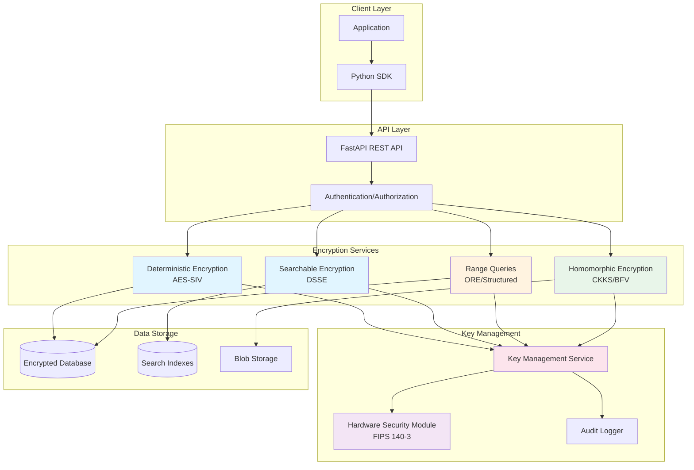
```mermaid
graph TB
    subgraph "Client Layer"
        APP[Application]
        SDK[Python SDK]
    end

    subgraph "API Layer"
        REST[FastAPI REST API]
        AUTH[Authentication/Authorization]
    end

    subgraph "Encryption Services"
        DET[Deterministic Encryption<br/>AES-SIV]
        SSE[Searchable Encryption<br/>DSSE]
        RANGE[Range Queries<br/>ORE/Structured]
        HE[Homomorphic Encryption<br/>CKKS/BFV]
    end

    subgraph "Key Management"
        KMS[Key Management Service]
        HSM[Hardware Security Module<br/>FIPS 140-3]
        AUDIT[Audit Logger]
    end

    subgraph "Data Storage"
        DB[(Encrypted Database)]
        INDEX[(Search Indexes)]
        BLOB[Blob Storage]
    end

    APP --> SDK
    SDK --> REST
    REST --> AUTH
    AUTH --> DET
    AUTH --> SSE
    AUTH --> RANGE
    AUTH --> HE

    DET --> KMS
    SSE --> KMS
    RANGE --> KMS
    HE --> KMS

    KMS --> HSM
    KMS --> AUDIT

    DET --> DB
    SSE --> INDEX
    RANGE --> DB
    HE --> BLOB

    style DET fill:#e1f5ff
    style SSE fill:#e1f5ff
    style RANGE fill:#fff3e0
    style HE fill:#e8f5e9
    style KMS fill:#fce4ec
    style HSM fill:#f3e5f5
```

---

## System Components

### 1. Encryption Modules

#### 1.1 Deterministic Encryption (AES-SIV)

**Purpose**: Equality searches on account numbers, customer IDs, SSNs

**Properties**:
- Misuse-resistant AEAD (nonce reuse safe)
- Deterministic: same plaintext → same ciphertext
- 512-bit keys (AES-256-SIV)

**Usage**:
```python
from encrypted_ir import DeterministicEncryption

encryptor = DeterministicEncryption()
ciphertext = encryptor.encrypt("ACC-12345")
# Same plaintext always produces same ciphertext
```

**Leakage**: Equality patterns, frequency distribution

#### 1.2 Blind Indexes (HMAC-SHA256)

**Purpose**: Equality searches with reduced leakage

**Properties**:
- HMAC-based indexes with per-tenant salts
- Collision-resistant (2^128 security)
- No direct ciphertext determinism

**Architecture**:
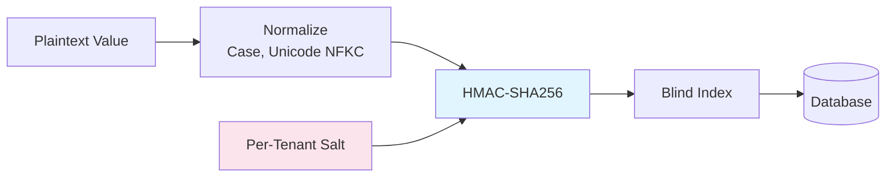
```mermaid
graph LR
    INPUT[Plaintext Value] --> NORM[Normalize<br/>Case, Unicode NFKC]
    NORM --> HMAC[HMAC-SHA256]
    SALT[Per-Tenant Salt] --> HMAC
    HMAC --> INDEX[Blind Index]
    INDEX --> DB[(Database)]

    style HMAC fill:#e1f5ff
    style SALT fill:#fce4ec
```

**Leakage**: Scoped equality (within tenant), bounded frequency

#### 1.3 Searchable Encryption (DSSE)

**Purpose**: Keyword search on encrypted documents/emails

**Properties**:
- Forward privacy: updates unlinkable to past queries
- Replay protection via nonces
- Optional PIR mode for zero-leakage

**Index Structure**:
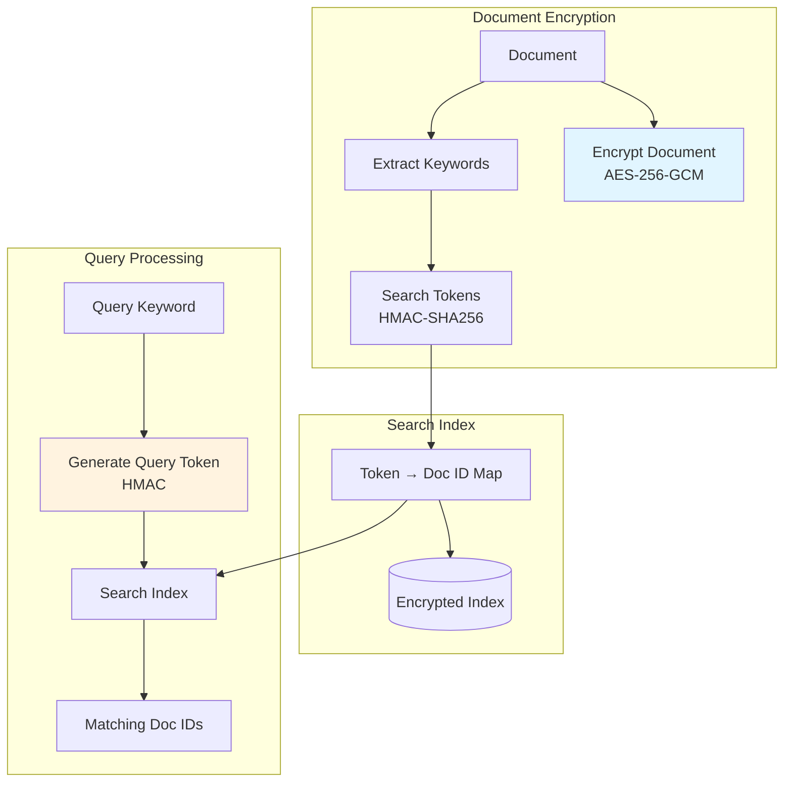
```mermaid
graph TB
    subgraph "Document Encryption"
        DOC[Document] --> EXTRACT[Extract Keywords]
        EXTRACT --> TOKENS[Search Tokens<br/>HMAC-SHA256]
        DOC --> ENC[Encrypt Document<br/>AES-256-GCM]
    end

    subgraph "Search Index"
        TOKENS --> INDEX[Token → Doc ID Map]
        INDEX --> STORE[(Encrypted Index)]
    end

    subgraph "Query Processing"
        QUERY[Query Keyword] --> QTOKEN[Generate Query Token<br/>HMAC]
        QTOKEN --> SEARCH[Search Index]
        INDEX --> SEARCH
        SEARCH --> RESULTS[Matching Doc IDs]
    end

    style ENC fill:#e1f5ff
    style QTOKEN fill:#fff3e0
```

**Leakage**: Search patterns, access patterns, result sizes

#### 1.4 Range Queries (ORE/Structured Encryption)

**Purpose**: Range queries on transaction amounts, dates

**Current**: OPE (simplified PRF-based)
**Target**: Lewi-Wu ORE or bucketed B-tree with padding

**ORE Upgrade Architecture**:

```mermaid
graph TB
    subgraph "Current: OPE (HIGH LEAKAGE)"
        OPE_IN[Plaintext Value] --> OPE_MAP[PRF-based Mapping]
        OPE_MAP --> OPE_OUT[Order-Preserving Ciphertext]
        OPE_OUT -.->|"Leaks: Full order + distribution"| LEAK1[❌ High Leakage]
    end

    subgraph "Target: ORE (REDUCED LEAKAGE)"
        ORE_IN[Plaintext Value] --> ORE_COMP[Lewi-Wu Comparator]
        ORE_COMP --> ORE_CT[ORE Ciphertext]
        ORE_CT -.->|"Leaks: Order only"| LEAK2[⚠️ Moderate Leakage]
    end

    subgraph "Alternative: Structured Encryption"
        SE_IN[Plaintext Value] --> BUCKET[Assign to Bucket]
        BUCKET --> TREE[Encrypted B-Tree]
        TREE --> FILTER[Client-Side Post-Filter]
        FILTER -.->|"Leaks: Bucket access"| LEAK3[⚠️ Moderate Leakage]
    end

    style OPE_MAP fill:#ffcdd2
    style ORE_COMP fill:#fff3e0
    style TREE fill:#e8f5e9
```

**Leakage**: Order (ORE), bucket access (structured encryption)

#### 1.5 Homomorphic Encryption (CKKS/BFV)

**Purpose**: Encrypted computation for credit scoring, analytics

**Properties**:
- IND-CPA security under RLWE/LWE
- SIMD batching for performance
- Large ciphertexts (100KB+ per vector)

**Computation Flow**:
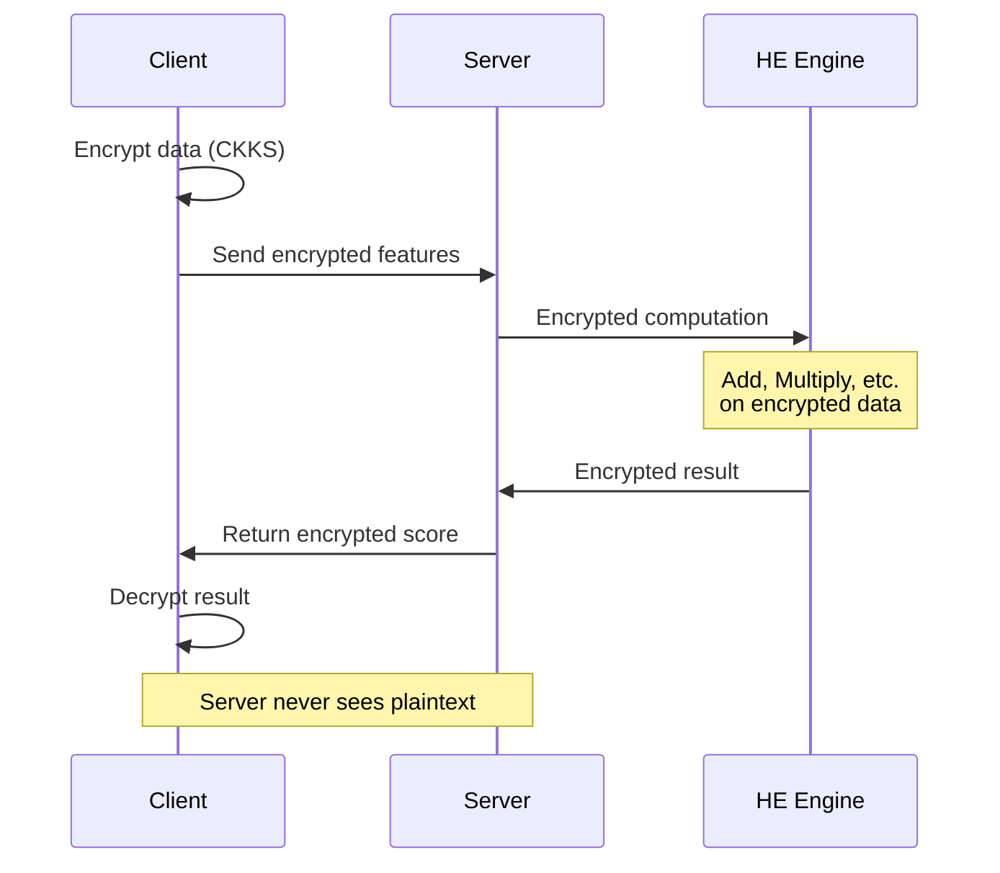
```mermaid
sequenceDiagram
    participant Client
    participant Server
    participant HE Engine

    Client->>Client: Encrypt data (CKKS)
    Client->>Server: Send encrypted features
    Server->>HE Engine: Encrypted computation
    Note over HE Engine: Add, Multiply, etc.<br/>on encrypted data
    HE Engine->>Server: Encrypted result
    Server->>Client: Return encrypted score
    Client->>Client: Decrypt result

    Note over Client,Server: Server never sees plaintext
```

**Leakage**: Model structure, computation timing, result sizes

---

## Data Flow Diagrams

### Equality Search Flow (Blind Index)

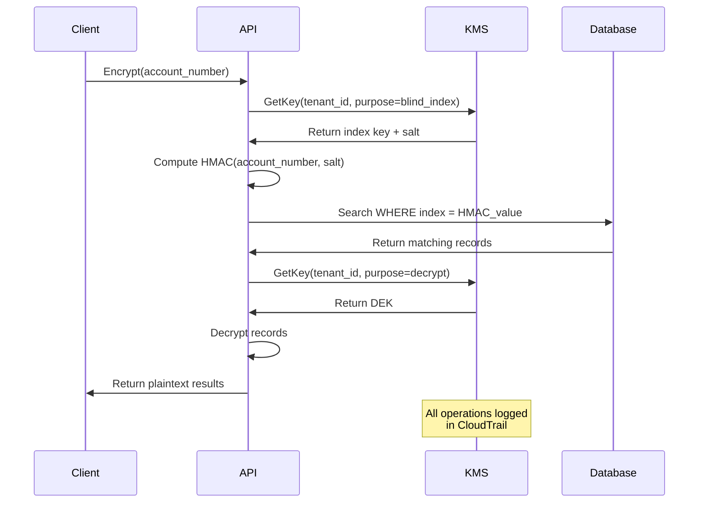
```mermaid
sequenceDiagram
    participant Client
    participant API
    participant KMS
    participant Database

    Client->>API: Encrypt(account_number)
    API->>KMS: GetKey(tenant_id, purpose=blind_index)
    KMS->>API: Return index key + salt
    API->>API: Compute HMAC(account_number, salt)
    API->>Database: Search WHERE index = HMAC_value
    Database->>API: Return matching records
    API->>KMS: GetKey(tenant_id, purpose=decrypt)
    KMS->>API: Return DEK
    API->>API: Decrypt records
    API->>Client: Return plaintext results

    Note over KMS: All operations logged<br/>in CloudTrail
```

### Document Encryption & Search Flow

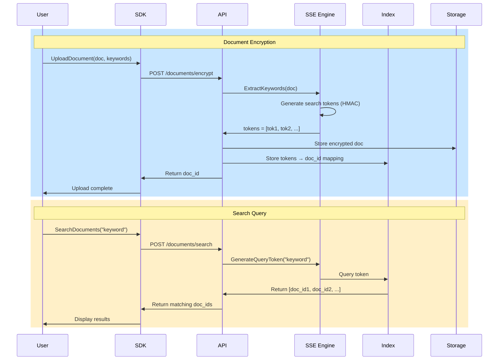
```mermaid
sequenceDiagram
    participant User
    participant SDK
    participant API
    participant SSE Engine
    participant Index
    participant Storage

    rect rgb(200, 230, 255)
    Note over User,Storage: Document Encryption
    User->>SDK: UploadDocument(doc, keywords)
    SDK->>API: POST /documents/encrypt
    API->>SSE Engine: ExtractKeywords(doc)
    SSE Engine->>SSE Engine: Generate search tokens (HMAC)
    SSE Engine->>API: tokens = [tok1, tok2, ...]
    API->>Storage: Store encrypted doc
    API->>Index: Store tokens → doc_id mapping
    API->>SDK: Return doc_id
    SDK->>User: Upload complete
    end

    rect rgb(255, 240, 200)
    Note over User,Storage: Search Query
    User->>SDK: SearchDocuments("keyword")
    SDK->>API: POST /documents/search
    API->>SSE Engine: GenerateQueryToken("keyword")
    SSE Engine->>Index: Query token
    Index->>API: Return [doc_id1, doc_id2, ...]
    API->>SDK: Return matching doc_ids
    SDK->>User: Display results
    end
```

### Range Query Flow (ORE)

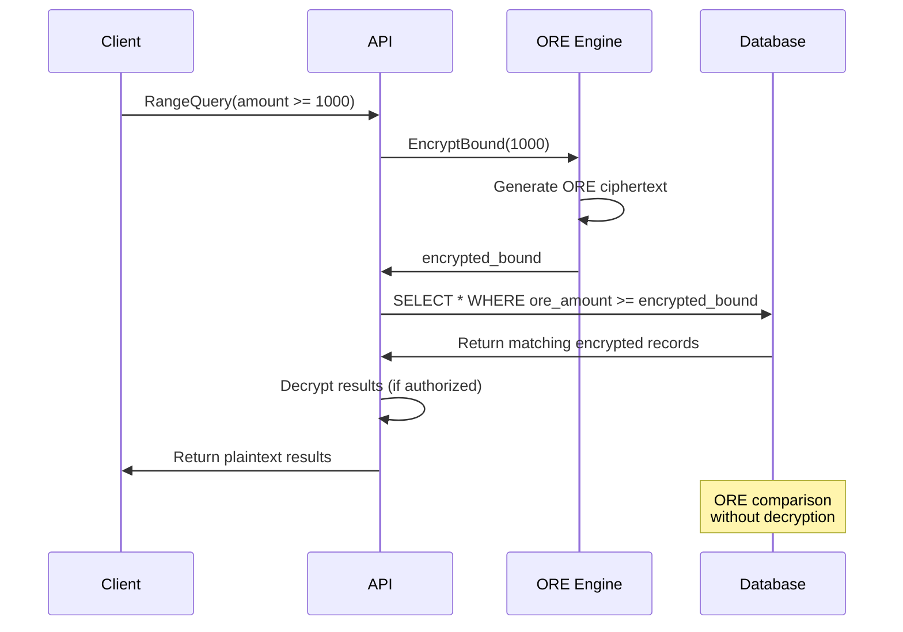
```mermaid
sequenceDiagram
    participant Client
    participant API
    participant ORE Engine
    participant Database

    Client->>API: RangeQuery(amount >= 1000)
    API->>ORE Engine: EncryptBound(1000)
    ORE Engine->>ORE Engine: Generate ORE ciphertext
    ORE Engine->>API: encrypted_bound
    API->>Database: SELECT * WHERE ore_amount >= encrypted_bound
    Database->>API: Return matching encrypted records
    API->>API: Decrypt results (if authorized)
    API->>Client: Return plaintext results

    Note over Database: ORE comparison<br/>without decryption
```

---

## Encryption Patterns

### Pattern 1: Envelope Encryption (KEK/DEK)

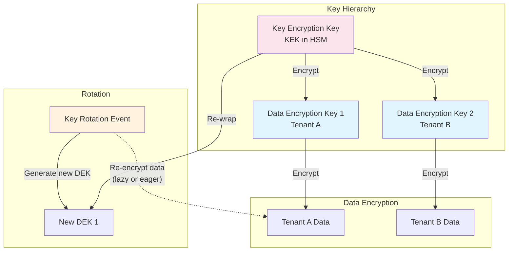
```mermaid
graph TB
    subgraph "Key Hierarchy"
        KEK[Key Encryption Key<br/>KEK in HSM]
        DEK1[Data Encryption Key 1<br/>Tenant A]
        DEK2[Data Encryption Key 2<br/>Tenant B]

        KEK -->|Encrypt| DEK1
        KEK -->|Encrypt| DEK2
    end

    subgraph "Data Encryption"
        DEK1 -->|Encrypt| DATA1[Tenant A Data]
        DEK2 -->|Encrypt| DATA2[Tenant B Data]
    end

    subgraph "Rotation"
        ROT[Key Rotation Event]
        ROT -->|Generate new DEK| DEK1_NEW[New DEK 1]
        KEK -->|Re-wrap| DEK1_NEW
        ROT -.->|"Re-encrypt data<br/>(lazy or eager)"| DATA1
    end

    style KEK fill:#fce4ec
    style DEK1 fill:#e1f5ff
    style DEK2 fill:#e1f5ff
    style ROT fill:#fff3e0
```

**Benefits**:
- KEK never leaves HSM
- DEK rotation without KEK change
- Per-tenant key isolation

### Pattern 2: Hybrid Multi-Layer Encryption

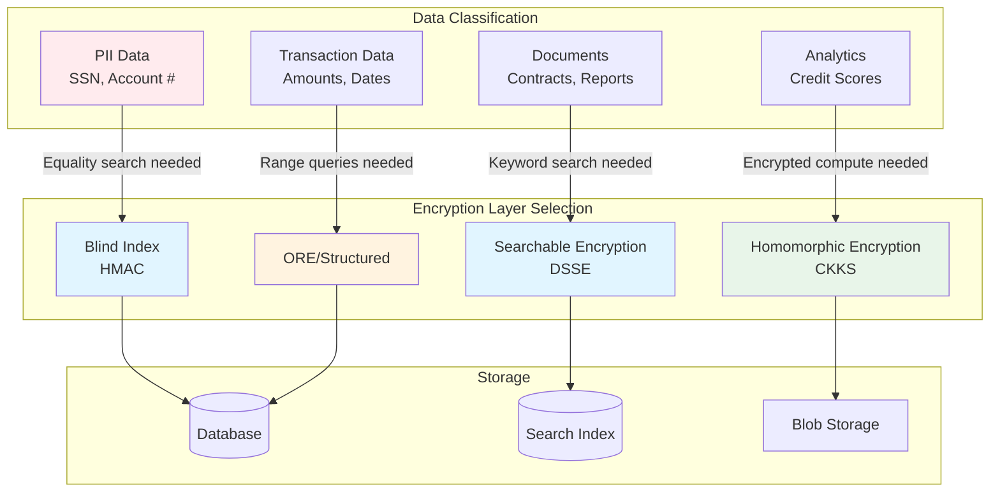
```mermaid
graph TB
    subgraph "Data Classification"
        PII[PII Data<br/>SSN, Account #]
        TXN[Transaction Data<br/>Amounts, Dates]
        DOC[Documents<br/>Contracts, Reports]
        ANALYTICS[Analytics<br/>Credit Scores]
    end

    subgraph "Encryption Layer Selection"
        PII -->|"Equality search needed"| BLIND[Blind Index<br/>HMAC]
        TXN -->|"Range queries needed"| ORE[ORE/Structured]
        DOC -->|"Keyword search needed"| SSE[Searchable Encryption<br/>DSSE]
        ANALYTICS -->|"Encrypted compute needed"| HE[Homomorphic Encryption<br/>CKKS]
    end

    subgraph "Storage"
        BLIND --> DB1[(Database)]
        ORE --> DB1
        SSE --> INDEX[(Search Index)]
        HE --> BLOB[Blob Storage]
    end

    style PII fill:#ffebee
    style BLIND fill:#e1f5ff
    style ORE fill:#fff3e0
    style SSE fill:#e1f5ff
    style HE fill:#e8f5e9
```

---

## Key Management Architecture

### KMS Integration (AWS KMS Example)

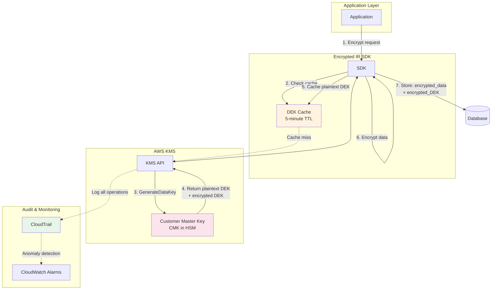
```mermaid
graph TB
    subgraph "Application Layer"
        APP[Application]
    end

    subgraph "Encrypted IR SDK"
        SDK[SDK]
        CACHE[DEK Cache<br/>5-minute TTL]
    end

    subgraph "AWS KMS"
        CMK[Customer Master Key<br/>CMK in HSM]
        API_KMS[KMS API]
    end

    subgraph "Audit & Monitoring"
        CLOUDTRAIL[CloudTrail]
        CLOUDWATCH[CloudWatch Alarms]
    end

    APP -->|1. Encrypt request| SDK
    SDK -->|2. Check cache| CACHE
    CACHE -.->|Cache miss| API_KMS
    API_KMS -->|3. GenerateDataKey| CMK
    CMK -->|4. Return plaintext DEK<br/>+ encrypted DEK| API_KMS
    API_KMS --> SDK
    SDK -->|5. Cache plaintext DEK| CACHE
    SDK -->|6. Encrypt data| SDK
    SDK -->|7. Store: encrypted_data<br/>+ encrypted_DEK| DB[(Database)]

    API_KMS -.->|Log all operations| CLOUDTRAIL
    CLOUDTRAIL -.->|Anomaly detection| CLOUDWATCH

    style CMK fill:#fce4ec
    style CACHE fill:#fff3e0
    style CLOUDTRAIL fill:#e8f5e9
```

### Key Rotation Process

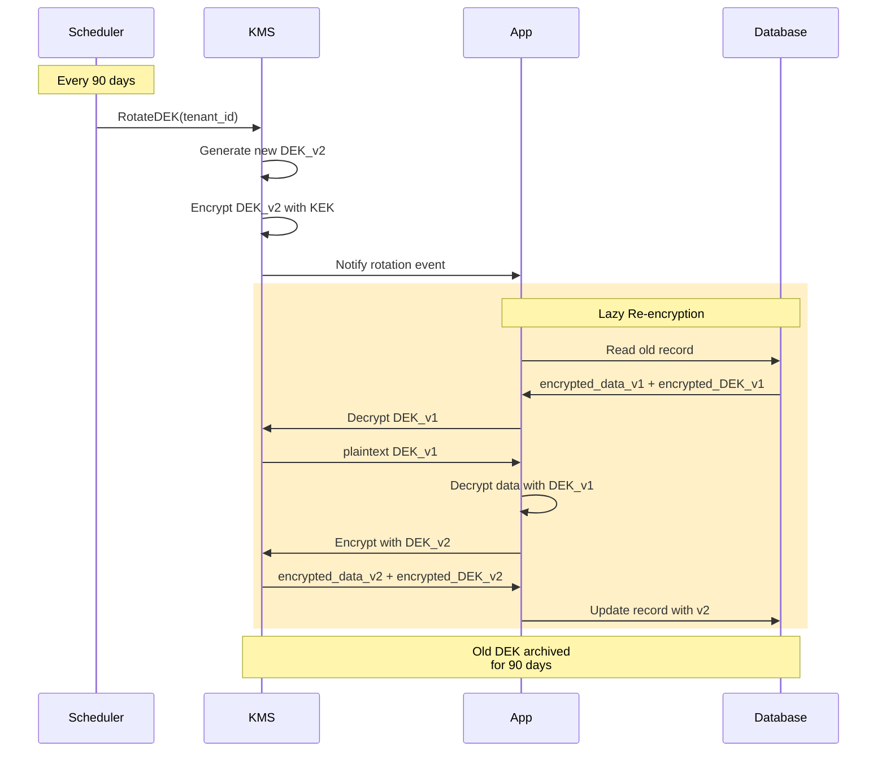
```mermaid
sequenceDiagram
    participant Scheduler
    participant KMS
    participant App
    participant Database

    Note over Scheduler: Every 90 days
    Scheduler->>KMS: RotateDEK(tenant_id)
    KMS->>KMS: Generate new DEK_v2
    KMS->>KMS: Encrypt DEK_v2 with KEK
    KMS->>App: Notify rotation event

    rect rgb(255, 240, 200)
    Note over App,Database: Lazy Re-encryption
    App->>Database: Read old record
    Database->>App: encrypted_data_v1 + encrypted_DEK_v1
    App->>KMS: Decrypt DEK_v1
    KMS->>App: plaintext DEK_v1
    App->>App: Decrypt data with DEK_v1
    App->>KMS: Encrypt with DEK_v2
    KMS->>App: encrypted_data_v2 + encrypted_DEK_v2
    App->>Database: Update record with v2
    end

    Note over KMS,Database: Old DEK archived<br/>for 90 days
```

---

## Deployment Models

### Model 1: Cloud-Native (AWS Example)

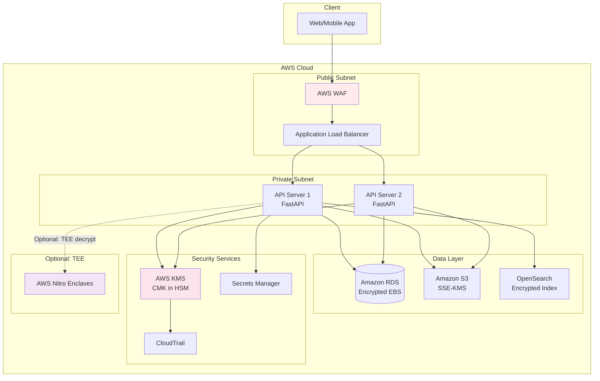
```mermaid
graph TB
    subgraph "Client"
        CLIENT[Web/Mobile App]
    end

    subgraph "AWS Cloud"
        subgraph "Public Subnet"
            ALB[Application Load Balancer]
            WAF[AWS WAF]
        end

        subgraph "Private Subnet"
            API1[API Server 1<br/>FastAPI]
            API2[API Server 2<br/>FastAPI]
        end

        subgraph "Data Layer"
            RDS[(Amazon RDS<br/>Encrypted EBS)]
            S3[Amazon S3<br/>SSE-KMS]
            OPENSEARCH[OpenSearch<br/>Encrypted Index]
        end

        subgraph "Security Services"
            KMS_AWS[AWS KMS<br/>CMK in HSM]
            SECRETS[Secrets Manager]
            CT[CloudTrail]
        end

        subgraph "Optional: TEE"
            NITRO[AWS Nitro Enclaves]
        end
    end

    CLIENT --> WAF
    WAF --> ALB
    ALB --> API1
    ALB --> API2

    API1 --> RDS
    API1 --> S3
    API1 --> OPENSEARCH
    API2 --> RDS
    API2 --> S3

    API1 --> KMS_AWS
    API2 --> KMS_AWS
    API1 --> SECRETS

    KMS_AWS --> CT

    API1 -.->|"Optional: TEE decrypt"| NITRO

    style KMS_AWS fill:#fce4ec
    style NITRO fill:#f3e5f5
    style WAF fill:#ffebee
```

### Model 2: On-Premises with HSM

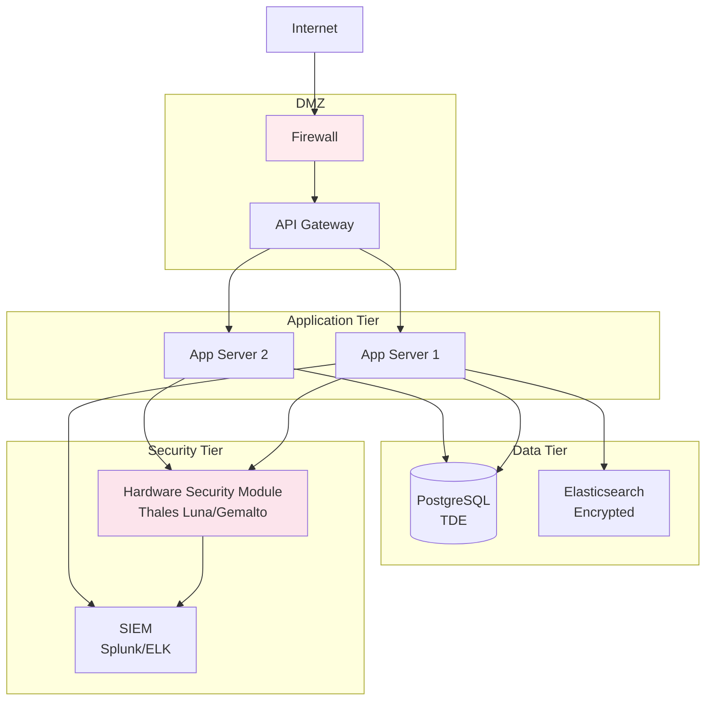
```mermaid
graph TB
    subgraph "DMZ"
        FW[Firewall]
        PROXY[API Gateway]
    end

    subgraph "Application Tier"
        APP1[App Server 1]
        APP2[App Server 2]
    end

    subgraph "Data Tier"
        PG[(PostgreSQL<br/>TDE)]
        ELASTIC[Elasticsearch<br/>Encrypted]
    end

    subgraph "Security Tier"
        HSM[Hardware Security Module<br/>Thales Luna/Gemalto]
        SIEM[SIEM<br/>Splunk/ELK]
    end

    INTERNET[Internet] --> FW
    FW --> PROXY
    PROXY --> APP1
    PROXY --> APP2

    APP1 --> PG
    APP1 --> ELASTIC
    APP2 --> PG

    APP1 --> HSM
    APP2 --> HSM

    HSM --> SIEM
    APP1 --> SIEM

    style HSM fill:#fce4ec
    style FW fill:#ffebee
```

---

## Performance Characteristics

### Latency by Operation (Typical)

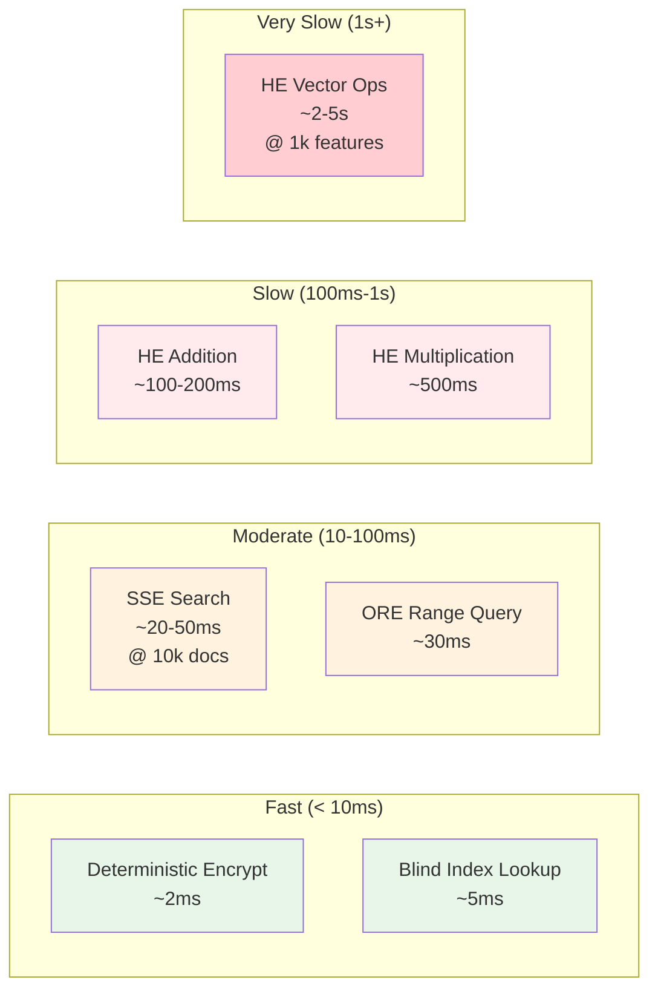
```mermaid
graph LR
    subgraph "Fast (< 10ms)"
        DET_ENC[Deterministic Encrypt<br/>~2ms]
        BLIND_INDEX[Blind Index Lookup<br/>~5ms]
    end

    subgraph "Moderate (10-100ms)"
        SSE_SEARCH[SSE Search<br/>~20-50ms<br/>@ 10k docs]
        ORE_RANGE[ORE Range Query<br/>~30ms]
    end

    subgraph "Slow (100ms-1s)"
        HE_ADD[HE Addition<br/>~100-200ms]
        HE_MULT[HE Multiplication<br/>~500ms]
    end

    subgraph "Very Slow (1s+)"
        HE_VECTOR[HE Vector Ops<br/>~2-5s<br/>@ 1k features]
    end

    style DET_ENC fill:#e8f5e9
    style BLIND_INDEX fill:#e8f5e9
    style SSE_SEARCH fill:#fff3e0
    style ORE_RANGE fill:#fff3e0
    style HE_ADD fill:#ffebee
    style HE_MULT fill:#ffebee
    style HE_VECTOR fill:#ffcdd2
```

### Throughput Estimates (Single Server)

| Operation | QPS | Latency (P50/P95/P99) |
|-----------|-----|------------------------|
| Blind Index | 10,000 | 2ms / 5ms / 10ms |
| Deterministic Encrypt | 5,000 | 3ms / 8ms / 15ms |
| SSE Search | 500 | 30ms / 80ms / 150ms |
| ORE Range Query | 300 | 40ms / 100ms / 200ms |
| HE Addition | 10 | 150ms / 300ms / 500ms |
| HE Credit Score | 2 | 2s / 4s / 8s |

---

## Security Boundaries

### Trust Boundaries

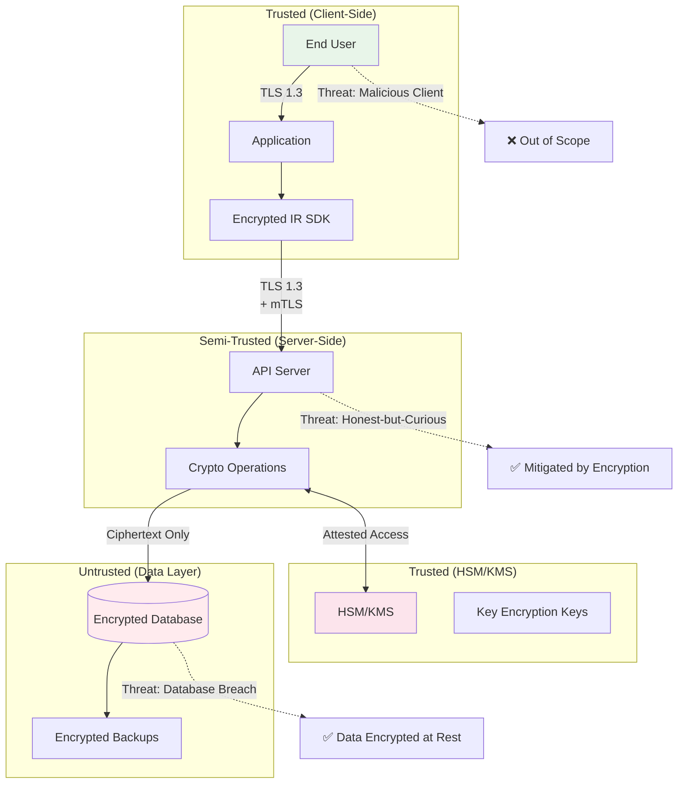
```mermaid
graph TB
    subgraph "Trusted (Client-Side)"
        USER[End User]
        APP[Application]
        SDK_TRUSTED[Encrypted IR SDK]
    end

    subgraph "Semi-Trusted (Server-Side)"
        API_SERVER[API Server]
        CRYPTO_OPS[Crypto Operations]
    end

    subgraph "Trusted (HSM/KMS)"
        HSM_TRUSTED[HSM/KMS]
        KEK[Key Encryption Keys]
    end

    subgraph "Untrusted (Data Layer)"
        DATABASE[(Encrypted Database)]
        BACKUP[Encrypted Backups]
    end

    USER -->|"TLS 1.3"| APP
    APP --> SDK_TRUSTED
    SDK_TRUSTED -->|"TLS 1.3<br/>+ mTLS"| API_SERVER
    API_SERVER --> CRYPTO_OPS
    CRYPTO_OPS <-->|"Attested Access"| HSM_TRUSTED
    CRYPTO_OPS -->|"Ciphertext Only"| DATABASE
    DATABASE --> BACKUP

    style USER fill:#e8f5e9
    style HSM_TRUSTED fill:#fce4ec
    style DATABASE fill:#ffebee

    USER -.->|"Threat: Malicious Client"| THREAT1[❌ Out of Scope]
    API_SERVER -.->|"Threat: Honest-but-Curious"| THREAT2[✅ Mitigated by Encryption]
    DATABASE -.->|"Threat: Database Breach"| THREAT3[✅ Data Encrypted at Rest]
```

### Attack Surface

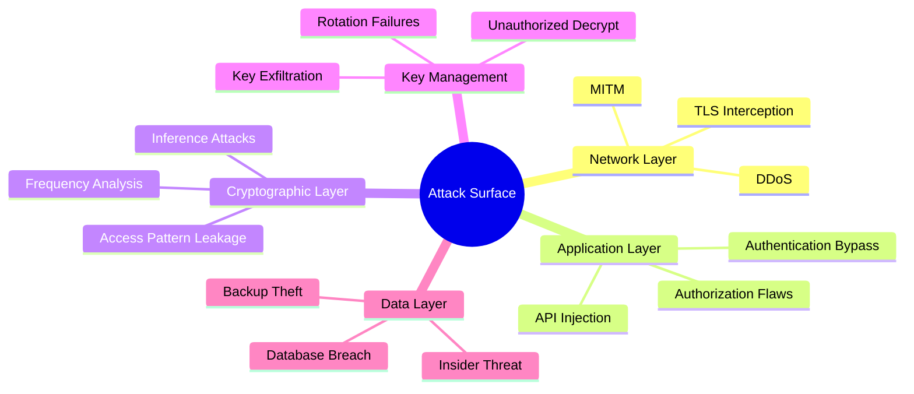
```mermaid
mindmap
    root((Attack Surface))
        Network Layer
            TLS Interception
            DDoS
            MITM
        Application Layer
            API Injection
            Authentication Bypass
            Authorization Flaws
        Cryptographic Layer
            Frequency Analysis
            Access Pattern Leakage
            Inference Attacks
        Key Management
            Key Exfiltration
            Unauthorized Decrypt
            Rotation Failures
        Data Layer
            Database Breach
            Backup Theft
            Insider Threat
```

---

## Scaling Considerations

### Horizontal Scaling

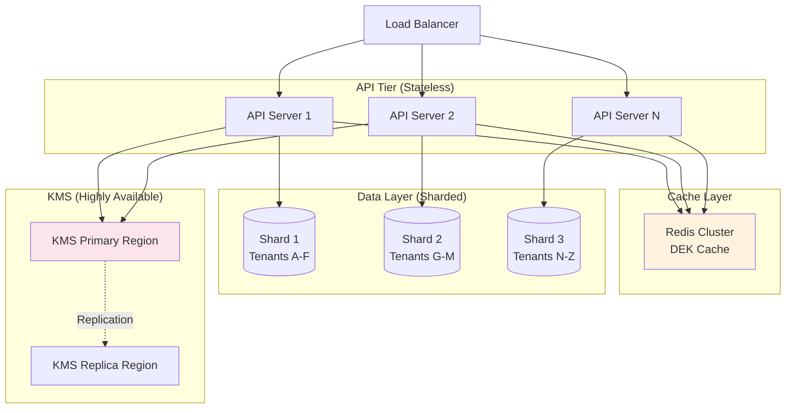
```mermaid
graph TB
    LB[Load Balancer]

    subgraph "API Tier (Stateless)"
        API1[API Server 1]
        API2[API Server 2]
        API3[API Server N]
    end

    subgraph "Cache Layer"
        REDIS[Redis Cluster<br/>DEK Cache]
    end

    subgraph "Data Layer (Sharded)"
        DB1[(Shard 1<br/>Tenants A-F)]
        DB2[(Shard 2<br/>Tenants G-M)]
        DB3[(Shard 3<br/>Tenants N-Z)]
    end

    subgraph "KMS (Highly Available)"
        KMS_PRIMARY[KMS Primary Region]
        KMS_REPLICA[KMS Replica Region]
    end

    LB --> API1
    LB --> API2
    LB --> API3

    API1 --> REDIS
    API2 --> REDIS
    API3 --> REDIS

    API1 --> DB1
    API2 --> DB2
    API3 --> DB3

    API1 --> KMS_PRIMARY
    API2 --> KMS_PRIMARY
    KMS_PRIMARY -.->|Replication| KMS_REPLICA

    style REDIS fill:#fff3e0
    style KMS_PRIMARY fill:#fce4ec
```

---

## Revision History

| Version | Date | Author | Changes |
|---------|------|--------|---------|
| 1.0 | 2025-01-11 | Architecture Team | Initial architecture documentation |

---

## References

1. NIST SP 800-57, "Key Management Recommendations"
2. AWS Architecture Well-Architected Framework
3. Microsoft SEAL Documentation
4. RFC 5297, "Synthetic Initialization Vector (SIV)"
5. Lewi & Wu, "Order-Revealing Encryption", 2016

---

**Classification**: Internal Use Only
**Review Cycle**: Quarterly
