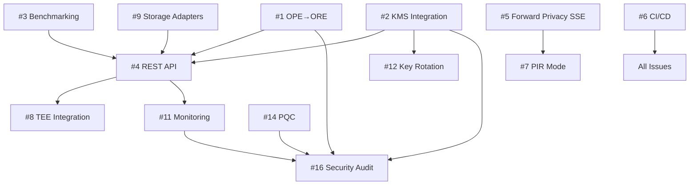

# GitHub Issues Backlog - Encrypted Information Retrieval MVP

This document contains the comprehensive backlog for upgrading the encrypted information retrieval system to 2025 best practices. Issues are prioritized as P0 (critical/blockers), P1 (production hardening), and P2 (advanced features).

---

## P0 - Critical Issues (MVP Blockers)

### Issue #1: Migrate from OPE to ORE for Order-Preserving Encryption

**Labels:** `priority/P0`, `area/crypto`, `compliance/DORA`, `compliance/PCI`

**Estimate:** 2 weeks

**Description:**

The current OPE (Order-Preserving Encryption) implementation leaks global order across all encrypted values, which fails to meet 2025 security standards. We need to migrate to ORE (Order-Revealing Encryption) using the Lewi-Wu construction for improved leakage profiles.

**Security Rationale:**
- Current OPE: Leaks global total order + frequency
- Target ORE: Leaks only pairwise comparison outcomes
- Required for DORA Art. 9 (state-of-the-art crypto) and PCI DSS 3.5.1 (strong cryptography)

**Acceptance Criteria:**
- [ ] Implement Lewi-Wu ORE construction with left/right ciphertexts
- [ ] Create `ORE` class in `/src/encrypted_ir/ore.py` with `encrypt()`, `compare()` methods
- [ ] Add range query support compatible with existing SSE interface
- [ ] Achieve O(1) comparison time for encrypted values
- [ ] Add deprecation warning to existing `OPE` class with migration guide
- [ ] Update `TransactionProcessing` use case in `use_cases.py` to use ORE
- [ ] Write 25+ unit tests covering:
  - Correctness (compare(encrypt(a), encrypt(b)) == cmp(a, b))
  - Range queries (between, greater than, less than)
  - Security properties (no order leakage from single ciphertext)
  - Performance benchmarks (P95 < 5ms per comparison)
- [ ] Update THREAT_MODEL.md with ORE leakage profile
- [ ] Document migration path in ADR-004

**Related ADRs:** ADR-004

**Compliance Mapping:**
- DORA Art. 9 §1(c): Up-to-date ICT systems
- PCI DSS 3.5.1: Strong cryptography for stored cardholder data
- NIST SP 800-57: Cryptographic algorithm selection

**References:**
- Lewi & Wu (2016): "Order-Revealing Encryption: New Constructions, Applications, and Lower Bounds"
- https://eprint.iacr.org/2016/612

---

### Issue #2: Implement Envelope Encryption with KMS Integration

**Labels:** `priority/P0`, `area/kms`, `area/crypto`, `compliance/DORA`, `compliance/PCI`, `compliance/NYDFS`

**Estimate:** 2 weeks

**Description:**

Current implementation uses direct encryption with master keys, which violates key management best practices. We need to implement envelope encryption (KEK/DEK pattern) with AWS KMS integration for FIPS 140-3 Level 3 key protection.

**Security Rationale:**
- KEK (Key Encryption Key) stored in HSM/KMS
- DEK (Data Encryption Key) rotates every 90 days
- Attested key release for TEE environments
- CloudTrail audit logging for all key operations

**Acceptance Criteria:**
- [ ] Enhance `KeyManager` class with KEK/DEK separation:
  - `generate_dek()`: Generate random 256-bit AES key
  - `wrap_dek(dek, kek_id)`: Encrypt DEK with KEK from KMS
  - `unwrap_dek(wrapped_dek, kek_id)`: Decrypt DEK using KMS
- [ ] Implement AWS KMS integration:
  - `create_kek()`: Create customer master key in KMS
  - `encrypt_dek()`: Call KMS Encrypt API
  - `decrypt_dek()`: Call KMS Decrypt API with CloudTrail logging
- [ ] Add DEK caching with TTL (default 1 hour):
  - LRU cache for unwrapped DEKs
  - Automatic expiration and refresh
  - Thread-safe cache access
- [ ] Implement key rotation:
  - `rotate_dek()`: Generate new DEK, re-encrypt all data keys
  - Track DEK version in encrypted blobs
  - Support multiple active DEKs during rotation
- [ ] Add configuration for KMS endpoints:
  - AWS KMS (production)
  - CloudHSM (high-security production)
  - Local mock KMS (development/testing)
- [ ] Write 30+ unit tests covering:
  - KEK/DEK lifecycle (create, wrap, unwrap, rotate)
  - KMS API integration (mock and integration tests)
  - Cache behavior (hit/miss, TTL expiration)
  - Error handling (KMS unavailable, invalid key ID)
  - Concurrent access to key cache
- [ ] Update ARCHITECTURE.md with envelope encryption diagram
- [ ] Document key rotation procedures in ops runbook

**Related ADRs:** ADR-006

**Compliance Mapping:**
- DORA Art. 10: Key management lifecycle
- PCI DSS 3.6.4: Cryptographic key changes for compromised keys
- NYDFS §500.15: Encryption of nonpublic information
- NIST SP 800-57 Part 1: Key management recommendations

**Implementation Notes:**
```python
# Example envelope encryption flow
kms = KMSClient(region='us-east-1')
key_manager = KeyManager(kms_client=kms)

# Generate and wrap DEK
dek = key_manager.generate_dek()
wrapped_dek, kek_id = key_manager.wrap_dek(dek)

# Encrypt data with DEK
cipher = AES_SIV(key=dek)
ciphertext = cipher.encrypt(plaintext)

# Store: wrapped_dek + ciphertext
# Decrypt: unwrap DEK from KMS, then decrypt ciphertext
```

---

### Issue #3: Implement Benchmarking Framework with Performance Targets

**Labels:** `priority/P0`, `area/perf`, `area/testing`

**Estimate:** 1 week

**Description:**

We need a comprehensive benchmarking framework to validate performance against SLAs and identify bottlenecks. This is critical for production readiness and capacity planning.

**Performance Targets:**
- Encryption: P95 < 10ms per record
- Blind index generation: P95 < 5ms
- Range queries (ORE): P95 < 50ms per 1000 records
- SSE search: P95 < 100ms per keyword
- HE operations: P95 < 500ms per computation

**Acceptance Criteria:**
- [ ] Integrate `pytest-benchmark` for automated benchmarking
- [ ] Create `/benchmarks/` directory with benchmark suites:
  - `bench_encryption.py`: AES-SIV, ORE, blind indexes
  - `bench_search.py`: SSE keyword search, range queries
  - `bench_he.py`: CKKS addition, multiplication, bootstrapping
  - `bench_kms.py`: KEK/DEK wrap/unwrap latency
- [ ] Implement benchmark utilities:
  - `BenchmarkRunner`: Execute all benchmarks, collect metrics
  - `ResultsFormatter`: Generate JSON/HTML reports
  - `RegressionDetector`: Compare against baseline, flag >10% degradation
- [ ] Collect metrics for each operation:
  - Latency (P50, P95, P99, max)
  - Throughput (ops/sec)
  - Memory usage (peak RSS)
  - CPU utilization
- [ ] Generate performance report:
  - `/benchmarks/results/latest.json`: Raw metrics
  - `/benchmarks/results/latest.html`: Visual dashboard with charts
  - `/benchmarks/results/baseline.json`: Reference for regression testing
- [ ] Add CI integration:
  - Run benchmarks on every PR
  - Fail CI if P95 regresses >10%
  - Post performance summary as PR comment
- [ ] Document performance characteristics in ARCHITECTURE.md
- [ ] Create capacity planning guide with scaling recommendations

**Related ADRs:** ADR-010 (Performance SLAs)

**Compliance Mapping:**
- DORA Art. 6: Performance testing for financial systems
- PCI DSS 12.3.4: Documentation of system components

**Example Benchmark:**
```python
import pytest

def test_blind_index_generation(benchmark):
    generator = BlindIndexGenerator("tenant_1")
    config = BlindIndexConfig(field_name="ssn")

    result = benchmark(generator.create_index, "123-45-6789", config)

    assert benchmark.stats['mean'] < 0.005  # 5ms target
    assert benchmark.stats['stddev'] < 0.001  # Low variance
```

---

### Issue #4: Build FastAPI REST API Layer

**Labels:** `priority/P0`, `area/api`, `area/security`, `compliance/DORA`

**Estimate:** 2 weeks

**Description:**

Implement a production-grade REST API using FastAPI to expose encrypted IR capabilities as a service. This enables client-server architecture required for DORA operational resilience.

**Functional Requirements:**
- CRUD operations for encrypted data (create, read, update, delete)
- Search endpoints (equality, range, keyword)
- Key management endpoints (rotate, list, revoke)
- Health check and metrics endpoints

**Acceptance Criteria:**
- [ ] Create FastAPI application in `/src/encrypted_ir/api/`:
  - `main.py`: Application factory, middleware, error handlers
  - `routes/`: Endpoint definitions (data, search, keys, admin)
  - `models/`: Pydantic request/response schemas
  - `dependencies/`: Auth, rate limiting, logging
- [ ] Implement authentication and authorization:
  - OAuth2 with JWT tokens
  - API key support for service accounts
  - Tenant isolation (validate tenant_id in JWT claims)
  - Role-based access control (admin, write, read-only)
- [ ] Add rate limiting:
  - 100 req/min per tenant (equality search)
  - 10 req/min per tenant (range queries, expensive operations)
  - 1000 req/min per tenant (reads)
  - 429 Too Many Requests with Retry-After header
- [ ] Implement request validation:
  - Pydantic schemas for all inputs
  - Sanitize user inputs (prevent injection attacks)
  - Validate tenant_id format (UUID)
  - Limit request body size (10 MB max)
- [ ] Add comprehensive error handling:
  - 400: Invalid input (with specific field errors)
  - 401: Unauthorized (missing/invalid token)
  - 403: Forbidden (insufficient permissions)
  - 404: Resource not found
  - 429: Rate limit exceeded
  - 500: Internal server error (with request ID for tracing)
- [ ] Implement endpoints:
  - `POST /v1/encrypt`: Encrypt plaintext data
  - `POST /v1/decrypt`: Decrypt ciphertext
  - `POST /v1/search/equality`: Blind index search
  - `POST /v1/search/range`: ORE range query
  - `POST /v1/search/keyword`: SSE keyword search
  - `POST /v1/keys/rotate`: Trigger DEK rotation
  - `GET /v1/keys`: List active keys for tenant
  - `GET /health`: Health check endpoint
  - `GET /metrics`: Prometheus metrics
- [ ] Generate OpenAPI specification:
  - Auto-generated from FastAPI
  - Include examples for all endpoints
  - Document rate limits and error codes
  - Export to `/docs/api/openapi.yaml`
- [ ] Add observability:
  - Request ID tracing (X-Request-ID header)
  - Structured logging (JSON format)
  - Prometheus metrics (request count, latency, errors)
  - CloudWatch integration for AWS deployments
- [ ] Write 40+ API tests:
  - Unit tests for route handlers
  - Integration tests with test client
  - Auth/authz tests (valid/invalid tokens)
  - Rate limiting tests
  - Error handling tests
- [ ] Create API documentation:
  - `/docs/api/README.md`: Getting started guide
  - `/docs/api/AUTHENTICATION.md`: Auth setup
  - `/docs/api/RATE_LIMITS.md`: Rate limit policies
  - Postman collection for manual testing

**Related ADRs:** ADR-008 (API Design)

**Compliance Mapping:**
- DORA Art. 6 §8: APIs for operational resilience
- NYDFS §500.15: Secure transmission of nonpublic information
- OWASP API Security Top 10

**Example Endpoint:**
```python
@router.post("/v1/search/equality", response_model=SearchResponse)
async def search_equality(
    request: EqualitySearchRequest,
    tenant: TenantInfo = Depends(get_current_tenant),
    rate_limiter: RateLimiter = Depends(get_rate_limiter)
):
    """Search for records matching exact value using blind index."""
    await rate_limiter.check_limit(tenant.id, operation="equality_search")

    generator = BlindIndexGenerator(tenant.id, tenant.master_key)
    blind_index = generator.create_index(request.value, request.config)

    results = await search_service.find_by_index(blind_index)
    return SearchResponse(matches=results, count=len(results))
```

---

### Issue #5: Enhance SSE with Explicit Forward Privacy Guarantees

**Labels:** `priority/P0`, `area/crypto`, `area/search`, `compliance/DORA`

**Estimate:** 1 week

**Description:**

Current SSE implementation lacks explicit forward privacy guarantees, which are required for DORA-compliant dynamic search. Forward privacy ensures that updates to the encrypted database do not reveal information about past queries.

**Security Rationale:**
- Forward privacy: Server cannot link new documents to past search queries
- Critical for dynamic datasets where documents are frequently added
- Required to prevent statistical inference attacks

**Acceptance Criteria:**
- [ ] Audit current SSE implementation for forward privacy:
  - Analyze update token generation
  - Identify any linkability between add operations and past queries
- [ ] Enhance SSE construction with forward privacy:
  - Use per-update random salts
  - Implement "dual-state" index (secure + auxiliary)
  - Add periodic re-encryption for auxiliary index
- [ ] Add explicit forward privacy tests:
  - `test_forward_privacy_add()`: Server cannot link new docs to past queries
  - `test_forward_privacy_update()`: Updates don't leak query history
  - Simulate honest-but-curious server adversary
- [ ] Document forward privacy guarantees in THREAT_MODEL.md:
  - Formal security definition
  - Leakage profile: "Update pattern only, no query-document linkage"
  - Assumptions and limitations
- [ ] Update SSE usage examples in documentation
- [ ] Add configuration option: `forward_privacy_mode = "strong" | "balanced" | "off"`
  - Strong: Maximum privacy, slower performance
  - Balanced: Practical privacy-performance tradeoff (default)
  - Off: Backward compatibility mode (deprecated)

**Related ADRs:** ADR-003 (SSE Selection)

**Compliance Mapping:**
- DORA Art. 9: State-of-the-art encryption
- GDPR Art. 25: Data protection by design

**References:**
- Bost (2016): "Σoφoς – Forward Secure Searchable Encryption"
- https://eprint.iacr.org/2016/728

---

### Issue #6: Add Project Infrastructure and CI/CD

**Labels:** `priority/P0`, `area/infra`, `area/devops`

**Estimate:** 3 days

**Description:**

Set up essential project infrastructure for development workflow, code quality, and continuous integration.

**Acceptance Criteria:**
- [ ] Create comprehensive Makefile with targets:
  - `make setup`: Install dependencies, pre-commit hooks
  - `make test`: Run pytest with coverage report
  - `make bench`: Run all benchmarks
  - `make lint`: Run code quality checks
  - `make format`: Auto-format code with black/isort
  - `make docs`: Generate API documentation
  - `make clean`: Remove build artifacts
  - `make security`: Run security scanners (bandit, safety)
- [ ] Configure pre-commit hooks (`.pre-commit-config.yaml`):
  - `black`: Code formatting
  - `isort`: Import sorting
  - `ruff`: Fast linting (replaces flake8, pylint)
  - `mypy`: Type checking
  - `bandit`: Security issue scanning
  - `trailing-whitespace`: Remove trailing spaces
  - `end-of-file-fixer`: Ensure files end with newline
- [ ] Set up GitHub Actions CI (`.github/workflows/ci.yml`):
  - Trigger: Push to main, all PRs
  - Jobs:
    - `test`: Run pytest on Python 3.11, 3.12
    - `lint`: Run all code quality checks
    - `security`: Run bandit + safety (dependency audit)
    - `bench`: Run benchmarks, check for >10% regression
    - `coverage`: Upload to Codecov (target: 90%+)
  - Required checks for PR merge: test, lint, security pass
- [ ] Create SECURITY.md:
  - Vulnerability reporting process
  - Contact: security@example.com
  - PGP key for encrypted reports
  - Response SLA: 24 hours for critical, 7 days for others
  - Disclosure policy (coordinated disclosure)
- [ ] Add dependabot configuration (`.github/dependabot.yml`):
  - Weekly Python dependency updates
  - Security updates: immediate
  - Group minor/patch updates
- [ ] Configure code coverage:
  - `pytest-cov` for local testing
  - Codecov for CI reporting
  - Coverage badge in README.md
  - Minimum 90% coverage requirement
- [ ] Set up documentation generation:
  - `sphinx` for API docs
  - Auto-generate from docstrings
  - Deploy to GitHub Pages or ReadTheDocs
- [ ] Create development documentation:
  - `docs/CONTRIBUTING.md`: Contribution guidelines
  - `docs/DEVELOPMENT.md`: Local setup, testing, debugging
  - `docs/CODE_STYLE.md`: Style guide and conventions

**Compliance Mapping:**
- DORA Art. 14: Testing and change management
- PCI DSS 6.3.2: Code review procedures

---

## P1 - Production Hardening Issues

### Issue #7: Implement PIR (Private Information Retrieval) Mode for SSE

**Labels:** `priority/P1`, `area/crypto`, `area/search`, `feature/zero-knowledge`

**Estimate:** 2 weeks

**Description:**

Add PIR mode to SSE for zero-leakage queries where even access patterns are hidden from the server. This provides the strongest privacy guarantees for sensitive search operations.

**Security Rationale:**
- Current SSE: Server learns which documents match query
- PIR mode: Server learns nothing (zero query leakage)
- Use case: Compliance queries, audit logs, whistleblower searches

**Acceptance Criteria:**
- [ ] Integrate SimplePIR or SealPIR library
- [ ] Implement PIR wrapper in `/src/encrypted_ir/pir.py`:
  - `PIRClient`: Generate query, decode response
  - `PIRServer`: Process query, return response
  - `PIRIndex`: Build PIR-compatible index from SSE results
- [ ] Add configuration:
  - `pir_scheme = "simple" | "seal" | "doublepir"`
  - `pir_database_size`: Fixed DB size (pad to power of 2)
  - `pir_entry_size`: Fixed entry size (pad documents)
- [ ] Implement hybrid SSE+PIR workflow:
  - Step 1: SSE keyword search → candidate set (server knows set size)
  - Step 2: PIR retrieval → specific document (server learns nothing)
- [ ] Add performance optimizations:
  - Batch PIR queries for multiple documents
  - Cache PIR database preprocessing
  - Use hardware acceleration (AVX2/AVX-512)
- [ ] Write 20+ tests covering:
  - Correctness (retrieve correct document)
  - Zero-leakage property (server cannot distinguish queries)
  - Performance benchmarks (P95 < 2 seconds per query)
- [ ] Update THREAT_MODEL.md with PIR leakage profile
- [ ] Document PIR mode usage and trade-offs

**Related ADRs:** ADR-009 (PIR Integration)

**Compliance Mapping:**
- GDPR Art. 25: Data protection by design (privacy by default)
- DORA Art. 9: Advanced cryptographic protection

**References:**
- SimplePIR: https://eprint.iacr.org/2022/949
- SealPIR: https://eprint.iacr.org/2017/1142

---

### Issue #8: Add TEE Integration (AWS Nitro Enclaves)

**Labels:** `priority/P1`, `area/security`, `area/tee`, `compliance/PCI`

**Estimate:** 2 weeks

**Description:**

Integrate Trusted Execution Environments (TEE) for hardware-based key isolation and attested computation. This provides defense-in-depth for cryptographic operations.

**Acceptance Criteria:**
- [ ] Implement AWS Nitro Enclaves integration:
  - Enclave application for key management operations
  - Attestation flow (PCR measurements, signed attestation document)
  - Secure channel between parent instance and enclave
- [ ] Add attested key release:
  - KMS unwraps DEK only after verifying enclave attestation
  - Bind keys to specific enclave measurements
  - Support key provisioning to enclaves
- [ ] Implement secure enclave services:
  - Key generation (CSR creation inside enclave)
  - Encryption/decryption operations
  - Blind signature generation
- [ ] Add fallback mode for non-TEE environments:
  - Graceful degradation to software-only mode
  - Clear documentation of security implications
- [ ] Write integration tests:
  - Mock attestation for CI testing
  - Real Nitro Enclave tests (manual/staging only)
- [ ] Document TEE deployment:
  - Enclave provisioning guide
  - Measurement verification procedures
  - Monitoring and health checks

**Related ADRs:** ADR-007 (TEE Strategy)

**Compliance Mapping:**
- PCI DSS 3.5.1.2: Hardware security modules
- NIST SP 800-190: Container security (secure enclaves)

---

### Issue #9: Implement Database Storage Adapters

**Labels:** `priority/P1`, `area/storage`, `area/integration`

**Estimate:** 2 weeks

**Description:**

Create pluggable storage adapters for PostgreSQL, S3, and OpenSearch to support diverse deployment models.

**Acceptance Criteria:**
- [ ] Define `StorageAdapter` interface:
  - `store(key, value, metadata)`
  - `retrieve(key)`
  - `search(index_value)`
  - `delete(key)`
- [ ] Implement PostgreSQL adapter:
  - Table schema for encrypted data
  - Indexes for blind index columns
  - Connection pooling (pgbouncer compatible)
  - Prepared statements (SQL injection prevention)
- [ ] Implement S3 adapter:
  - Bucket structure (per-tenant prefixes)
  - Server-side encryption (SSE-KMS)
  - Versioning support
  - Lifecycle policies for key rotation
- [ ] Implement OpenSearch adapter:
  - Index templates for encrypted fields
  - Keyword search on blind indexes
  - Aggregations on ORE-encrypted values
  - Secure cluster configuration
- [ ] Add configuration management:
  - Environment-based config (dev/staging/prod)
  - Credential management (AWS Secrets Manager)
  - Connection retry and circuit breaker
- [ ] Write adapter tests:
  - Unit tests with mocked clients
  - Integration tests with test containers
  - Performance benchmarks per adapter
- [ ] Document adapter selection guide

**Compliance Mapping:**
- DORA Art. 28: Outsourcing arrangements (cloud storage)
- PCI DSS 3.5.1: Stored cardholder data protection

---

### Issue #10: Add Backward Privacy for SSE Deletes

**Labels:** `priority/P1`, `area/crypto`, `area/search`

**Estimate:** 1 week

**Description:**

Enhance SSE with backward privacy to prevent deleted documents from leaking information about past queries.

**Acceptance Criteria:**
- [ ] Implement backward-private SSE deletion:
  - Delete token generation (cannot be linked to add tokens)
  - Secure index pruning
  - Garbage collection for deleted entries
- [ ] Add periodic re-encryption:
  - Trigger after N deletions
  - Full index rebuild with fresh randomness
- [ ] Test backward privacy properties:
  - Server cannot link deletions to past queries
  - Deleted documents cannot be recovered
- [ ] Document backward privacy guarantees

**Related ADRs:** ADR-003

**References:**
- Bost & Fouque (2017): "Thwarting Leakage Abuse Attacks"

---

### Issue #11: Implement Comprehensive Logging and Monitoring

**Labels:** `priority/P1`, `area/observability`, `compliance/DORA`, `compliance/PCI`

**Estimate:** 1 week

**Description:**

Add production-grade logging and monitoring for security auditing and operational visibility.

**Acceptance Criteria:**
- [ ] Implement structured logging:
  - JSON format (timestamp, level, message, context)
  - Correlation IDs for request tracing
  - Log levels: DEBUG, INFO, WARN, ERROR, CRITICAL
  - PII redaction (never log plaintext or keys)
- [ ] Add security audit logging:
  - All key operations (generate, wrap, unwrap, rotate, delete)
  - Authentication events (login, logout, token refresh)
  - Authorization failures (403 responses)
  - Search queries (operation type, tenant, timestamp)
  - Configuration changes
- [ ] Implement Prometheus metrics:
  - Request count by endpoint (counter)
  - Request latency by endpoint (histogram)
  - Active connections (gauge)
  - Error rate by type (counter)
  - Key cache hit rate (gauge)
  - Queue depth for async operations (gauge)
- [ ] Add CloudWatch integration:
  - Log aggregation (CloudWatch Logs)
  - Metric streaming
  - Alarm configuration:
    - Error rate > 1%
    - P95 latency > SLA threshold
    - KMS API errors
- [ ] Create monitoring dashboards:
  - Grafana dashboard for metrics
  - CloudWatch dashboard for AWS deployments
  - Include SLI/SLO tracking
- [ ] Document monitoring runbook:
  - Alert response procedures
  - Troubleshooting guides
  - Escalation paths

**Compliance Mapping:**
- DORA Art. 17: Continuous monitoring
- PCI DSS 10.2.2: Automated audit trails
- NYDFS §500.06: Audit trail requirements

---

### Issue #12: Implement Automated Key Rotation Procedures

**Labels:** `priority/P1`, `area/kms`, `area/ops`, `compliance/PCI`

**Estimate:** 1 week

**Description:**

Automate DEK and KEK rotation procedures with zero-downtime rollover.

**Acceptance Criteria:**
- [ ] Implement DEK rotation:
  - Schedule: Every 90 days (configurable)
  - Process: Generate new DEK, re-encrypt data keys, retire old DEK
  - Support multiple active DEKs during transition
  - Track DEK version in encrypted blobs
- [ ] Implement KEK rotation:
  - Schedule: Annually (configurable)
  - Process: Create new KEK in KMS, re-wrap all DEKs, retire old KEK
  - Zero-downtime rotation (blue-green key deployment)
- [ ] Add rotation automation:
  - Cron job / scheduled Lambda
  - Progress tracking (% records re-encrypted)
  - Rollback capability
  - Notification on completion/failure
- [ ] Implement emergency rotation:
  - Triggered on key compromise
  - High-priority rotation (complete within 24 hours)
  - Automated compliance notification
- [ ] Add key lifecycle management:
  - Track key age, usage count, last rotation
  - Automatic archival of retired keys (7-year retention for PCI)
  - Secure key destruction after retention period
- [ ] Write rotation tests:
  - Successful rotation (all data re-encrypted)
  - Partial failure and recovery
  - Concurrent access during rotation
  - Performance impact measurement
- [ ] Document rotation procedures:
  - Ops runbook with step-by-step instructions
  - Emergency rotation playbook
  - Audit evidence collection

**Compliance Mapping:**
- PCI DSS 3.6.4: Key rotation and retirement
- NYDFS §500.15: Periodic key changes
- NIST SP 800-57: Key lifecycle management

---

### Issue #13: Add Differential Privacy for Query Result Statistics

**Labels:** `priority/P1`, `area/privacy`, `feature/advanced`

**Estimate:** 1 week

**Description:**

Implement differential privacy for aggregate statistics over encrypted data to prevent statistical inference attacks.

**Acceptance Criteria:**
- [ ] Implement DP mechanisms:
  - Laplace mechanism for count queries
  - Gaussian mechanism for sum/average queries
  - Exponential mechanism for non-numeric queries
- [ ] Add privacy budget tracking:
  - Per-tenant ε (epsilon) budget
  - Budget depletion warnings
  - Automatic query rejection when budget exhausted
- [ ] Create DP query interface:
  - `dp_count(predicate, epsilon)`
  - `dp_sum(field, predicate, epsilon)`
  - `dp_average(field, predicate, epsilon)`
- [ ] Add privacy analysis:
  - Formal privacy guarantee (ε, δ)-DP
  - Composition analysis for multiple queries
  - Privacy-utility tradeoff documentation
- [ ] Write DP tests:
  - Privacy guarantee verification
  - Utility/accuracy tests
  - Budget tracking tests
- [ ] Document DP usage and configuration

**Compliance Mapping:**
- GDPR Art. 32: Pseudonymization and aggregation
- DORA Art. 9: Advanced privacy techniques

**References:**
- Dwork & Roth (2014): "The Algorithmic Foundations of Differential Privacy"

---

## P2 - Advanced Features (2025 H2)

### Issue #14: Implement Hybrid Post-Quantum Cryptography

**Labels:** `priority/P2`, `area/crypto`, `area/pqc`, `compliance/NIST`

**Estimate:** 3 weeks

**Description:**

Prepare for post-quantum threat by implementing hybrid classical+PQC encryption using NIST-standardized algorithms.

**Security Rationale:**
- NIST FIPS 203 (ML-KEM/Kyber) finalized August 2024
- Hybrid mode: X25519 + Kyber768 for key exchange
- Defense-in-depth against quantum and classical attacks

**Acceptance Criteria:**
- [ ] Integrate NIST PQC libraries:
  - `liboqs` or `pqcrypto` for Python
  - ML-KEM-768 (Kyber) for key encapsulation
  - ML-DSA (Dilithium) for digital signatures
- [ ] Implement hybrid key exchange:
  - Combine classical ECDH + Kyber KEM
  - Concatenate shared secrets with KDF (HKDF-SHA256)
  - Use combined key for AES-SIV encryption
- [ ] Add algorithm agility:
  - Algorithm identifier in encrypted blobs (`alg: "aes-siv+kyber768"`)
  - Support multiple algorithms simultaneously
  - Gradual rollout mechanism (feature flag)
- [ ] Implement PQ-secure signatures:
  - Dilithium3 for authentication tokens
  - Hybrid ECDSA + Dilithium for backward compatibility
- [ ] Add crypto-agility framework:
  - Algorithm registry
  - Version negotiation protocol
  - Deprecation notices for weak algorithms
- [ ] Write PQC tests:
  - Correctness (encrypt/decrypt with Kyber)
  - Hybrid mode (classical+PQ key combination)
  - Algorithm selection and negotiation
  - Performance benchmarks (Kyber ~10x slower than ECDH)
- [ ] Update THREAT_MODEL.md with quantum adversary analysis
- [ ] Document PQC migration strategy

**Related ADRs:** ADR-011 (PQC Roadmap)

**Compliance Mapping:**
- NIST FIPS 203/204/205: PQC standards
- DORA Art. 9: Forward-looking cryptography
- NSA CNSA 2.0: Quantum-resistant algorithms by 2030

**Implementation Notes:**
```python
# Hybrid key exchange example
from pqcrypto.kem.kyber768 import generate_keypair, encrypt, decrypt
from cryptography.hazmat.primitives.asymmetric import x25519

# Classical + PQC keypairs
x25519_sk, x25519_pk = x25519.generate_key(), ...
kyber_sk, kyber_pk = generate_keypair()

# Hybrid KEM
classical_ss = x25519_sk.exchange(peer_x25519_pk)
pq_ss, pq_ct = encrypt(kyber_pk)

# Combine with KDF
combined_key = hkdf(classical_ss || pq_ss, ...)
```

**References:**
- NIST FIPS 203: Module-Lattice-Based Key-Encapsulation Mechanism Standard
- https://csrc.nist.gov/pubs/fips/203/final

---

### Issue #15: Implement Multi-Party Computation (MPC) for Collaborative Analytics

**Labels:** `priority/P2`, `area/crypto`, `area/mpc`, `feature/advanced`

**Estimate:** 4 weeks

**Description:**

Add secure multi-party computation capabilities for privacy-preserving collaborative analytics across multiple parties.

**Use Cases:**
- Cross-institution fraud detection (banks share encrypted fraud patterns)
- Regulatory reporting aggregation (preserve individual institution privacy)
- Collaborative ML training on encrypted datasets

**Acceptance Criteria:**
- [ ] Integrate MPC framework (MP-SPDZ or CrypTen)
- [ ] Implement MPC protocols:
  - Secure addition (for aggregation)
  - Secure comparison (for threshold detection)
  - Secure intersection (for set matching)
- [ ] Add party coordination:
  - Party registration and authentication
  - Secret sharing generation
  - Round synchronization
- [ ] Implement MPC workflows:
  - Aggregate computation (sum, average, count)
  - Threshold queries (find values > threshold)
  - Private set intersection (PSI)
- [ ] Write MPC tests:
  - Correctness (3-party and 5-party tests)
  - Security tests (honest-but-curious adversary)
  - Performance benchmarks
- [ ] Document MPC deployment and usage

**Compliance Mapping:**
- DORA Art. 28: Third-party risk management
- GDPR Art. 25: Privacy-preserving data sharing

---

### Issue #16: External Security Audit and Penetration Testing

**Labels:** `priority/P2`, `area/security`, `area/audit`, `compliance/DORA`

**Estimate:** 4 weeks (external)

**Description:**

Engage external security auditors for comprehensive cryptographic review and penetration testing before production deployment.

**Scope:**
- Cryptographic implementation review (algorithm selection, key management)
- Source code audit (vulnerabilities, side channels)
- Penetration testing (API, authentication, injection attacks)
- Compliance assessment (DORA, PCI DSS, NYDFS)

**Deliverables:**
- [ ] Security audit report with findings and remediation
- [ ] Penetration testing report with exploit proofs
- [ ] Compliance gap analysis
- [ ] Remediation plan with priorities

**Timeline:**
- RFP issuance: 2025 Q1
- Vendor selection: 2025 Q1
- Audit execution: 2025 Q2
- Remediation: 2025 Q2-Q3

**Compliance Mapping:**
- DORA Art. 24: Testing of ICT systems
- PCI DSS 11.3: Penetration testing requirements
- NYDFS §500.05: Periodic penetration testing

---

### Issue #17: Implement GraphQL API Alternative

**Labels:** `priority/P2`, `area/api`, `feature/enhancement`

**Estimate:** 2 weeks

**Description:**

Provide GraphQL API as an alternative to REST for clients requiring flexible querying capabilities.

**Acceptance Criteria:**
- [ ] Implement GraphQL schema with Strawberry or Graphene
- [ ] Define types for encrypted data, search results, keys
- [ ] Implement queries and mutations
- [ ] Add GraphQL-specific auth (JWT in headers)
- [ ] Implement field-level permissions
- [ ] Add query complexity analysis (prevent DoS)
- [ ] Generate GraphQL schema documentation
- [ ] Write API tests for GraphQL endpoints

---

### Issue #18: Add Support for Encrypted Geospatial Queries

**Labels:** `priority/P2`, `area/crypto`, `feature/geospatial`

**Estimate:** 3 weeks

**Description:**

Extend encrypted search to support geospatial range queries (proximity search, bounding box) while preserving location privacy.

**Approach:**
- Geohash-based blind indexes for approximate location
- ORE for encrypted latitude/longitude
- Private proximity testing protocols

**Acceptance Criteria:**
- [ ] Implement geohash blind indexes
- [ ] Add proximity search (within radius)
- [ ] Add bounding box search
- [ ] Analyze location privacy leakage
- [ ] Write geospatial query tests
- [ ] Document geospatial capabilities

---

## Immediate Action Items (This Week)

### Issue #19: Add Deprecation Warning to OPE Module

**Labels:** `priority/P0`, `area/crypto`, `area/docs`

**Estimate:** 30 minutes

**Description:**

Add clear deprecation warning to existing OPE implementation to guide users toward ORE migration.

**Acceptance Criteria:**
- [ ] Add `@deprecated` decorator to OPE class
- [ ] Add runtime warning on OPE instantiation:
  ```python
  warnings.warn(
      "OPE is deprecated and will be removed in v2.0. "
      "Migrate to ORE for improved security. "
      "See docs/migration/OPE_TO_ORE.md for details.",
      DeprecationWarning,
      stacklevel=2
  )
  ```
- [ ] Create migration guide: `/docs/migration/OPE_TO_ORE.md`
- [ ] Update README.md with deprecation notice
- [ ] Add timeline: OPE removal in version 2.0 (Q3 2025)

---

### Issue #20: Create Operations Runbook

**Labels:** `priority/P1`, `area/ops`, `area/docs`

**Estimate:** 1 day

**Description:**

Create comprehensive operations runbook for production deployment and incident response.

**Contents:**
- [ ] Deployment procedures (dev, staging, prod)
- [ ] Key rotation procedures (scheduled and emergency)
- [ ] Incident response playbooks:
  - Key compromise
  - Data breach
  - Service degradation
  - KMS unavailability
- [ ] Monitoring and alerting setup
- [ ] Backup and recovery procedures
- [ ] Escalation contacts and SLAs
- [ ] Compliance reporting procedures

**Location:** `/docs/ops/RUNBOOK.md`

---

## Labels and Project Organization

### Priority Labels:
- `priority/P0` - Critical/blockers for MVP
- `priority/P1` - Production hardening
- `priority/P2` - Advanced features
- `priority/P3` - Nice-to-have

### Area Labels:
- `area/crypto` - Cryptographic primitives
- `area/kms` - Key management
- `area/api` - REST/GraphQL API
- `area/search` - Search functionality
- `area/storage` - Database/storage
- `area/perf` - Performance optimization
- `area/docs` - Documentation
- `area/testing` - Test infrastructure
- `area/infra` - CI/CD and tooling
- `area/security` - Security hardening
- `area/compliance` - Regulatory compliance
- `area/ops` - Operations and deployment

### Compliance Labels:
- `compliance/DORA` - EU DORA regulation
- `compliance/PCI` - PCI DSS v4.0.1
- `compliance/NYDFS` - NYDFS Part 500
- `compliance/GDPR` - GDPR requirements
- `compliance/NIST` - NIST standards

### Feature Labels:
- `feature/encryption` - Encryption features
- `feature/search` - Search features
- `feature/key-mgmt` - Key management
- `feature/zero-knowledge` - Zero-knowledge proofs
- `feature/advanced` - Advanced cryptography
- `feature/pqc` - Post-quantum crypto

---

## GitHub Project Board Structure

Create project: **"Encrypted IR — MVP to Production"**

### Swimlanes:
1. **Backlog** - All new issues
2. **P0 - Critical (Sprint 1-2)** - Issues #1-6
3. **P1 - Production (Sprint 3-5)** - Issues #7-13
4. **P2 - Advanced (2025 H2)** - Issues #14-18
5. **In Progress** - Currently being worked on
6. **In Review** - PRs under review
7. **Done** - Completed and merged

### Milestones:
- **v0.5.0 - MVP** (Target: 8 weeks from now)
  - Issues: #1, #2, #3, #4, #5, #6
  - Deliverable: Production-ready encrypted IR with REST API, KMS, ORE, benchmarks

- **v1.0.0 - Production** (Target: 14 weeks from now)
  - Issues: #7, #8, #9, #10, #11, #12, #13
  - Deliverable: Fully hardened system with PIR, TEE, monitoring, automation

- **v2.0.0 - Advanced** (Target: 2025 H2)
  - Issues: #14, #15, #16, #17, #18
  - Deliverable: PQC-ready, MPC-enabled, externally audited

### Views:
1. **By Priority** - Group by priority label
2. **By Area** - Group by area label
3. **By Compliance** - Group by compliance label
4. **Timeline** - Gantt chart view with milestones

---

## Issue Dependencies



---

## Success Metrics

### P0 Completion (v0.5.0 MVP):
- ✅ All 6 P0 issues closed
- ✅ 200+ total unit tests passing
- ✅ All benchmarks meet SLA targets
- ✅ REST API operational with OAuth2
- ✅ 95%+ test coverage
- ✅ Zero high/critical security findings

### P1 Completion (v1.0.0 Production):
- ✅ All 13 P0+P1 issues closed
- ✅ PIR mode operational
- ✅ TEE integration complete
- ✅ Automated key rotation deployed
- ✅ Monitoring dashboards live
- ✅ External security audit passed

### P2 Completion (v2.0.0 Advanced):
- ✅ Hybrid PQC implemented
- ✅ MPC protocols operational
- ✅ External audit certification received
- ✅ Full compliance documentation

---

## Estimated Timeline

| Phase | Duration | Issues | Deliverable |
|-------|----------|--------|-------------|
| **Phase 1: MVP** | 6-8 weeks | #1-6 | Production-ready core |
| **Phase 2: Production** | +6 weeks | #7-13 | Fully hardened system |
| **Phase 3: Advanced** | 2025 H2 | #14-18 | PQC + audit certification |

**Total estimated effort:**
- P0: ~10 weeks (with parallelization: 6-8 weeks)
- P1: ~10 weeks
- P2: ~16 weeks

---

## Notes for Issue Creation

When creating these issues in GitHub:

1. **Copy sections verbatim** - Each issue block contains complete description, acceptance criteria, etc.

2. **Apply labels** - Use the labels specified in each issue header

3. **Set milestone** - Assign to appropriate milestone (v0.5.0, v1.0.0, v2.0.0)

4. **Link dependencies** - Reference dependent issues in the description

5. **Add to project board** - Add to "Encrypted IR — MVP to Production" project

6. **Estimate story points** - Use Fibonacci scale (1, 2, 3, 5, 8, 13, 21)
   - 30 min = 1 point
   - 1 day = 2 points
   - 1 week = 8 points
   - 2 weeks = 13 points

7. **Assign owners** - Assign to team members or leave unassigned for backlog

---

**Total Issues:** 20 (6 P0, 7 P1, 5 P2, 2 immediate)

**Next Steps:**
1. Review this document with the team
2. Create all issues in GitHub
3. Set up project board with swimlanes
4. Configure milestones and timeline
5. Begin Sprint 1 with P0 issues #1, #2, #3
